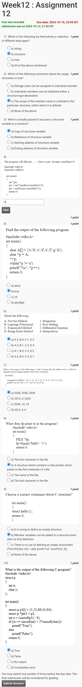

# NPTEL Course Assignment Submission
## Problem Solving Through Programming in C
**Assignment Submission for october 16**

- **Course Name:** Problem Solving Through Programming in C (PPS)
- **Course Platform:** NPTEL
- **Assignment Due Date:** October 16, 2024, 23:59 IST
- **C Program Submission Due Date:** October 17, 2024, 23:59 IST

---
### Assignment Overview:

---

## C Program Assignments:

### Program 1: Write a program in C to find the factorial of a given number using pointers. 
```c
#include <stdio.h>
void findFact(int, long int*);
int main()
{
        long int fact; //factorial of the number
        int num1; 
		scanf("%d",&num1); //The number is taken from test data

         findFact(num1, &fact);
         printf("The Factorial of %d is: %ld\n",num1, fact);
         return 0;
        }
```
Answer:
```c
void findFact(int n, long int *f)
        {
        int i;
 
       *f =1;
       for(i=1;i<=n;i++)
       *f=*f*i;
       }
```

### Program 2: Write a C program to print the Record of the Student Merit wise. Here a structure variable is defined which contains student rollno, name and score.
```c
#include<stdio.h>
struct student
{
int rollno;
char name[20];
int score;
};
void main()
{
struct student s[20];
int i, n;

scanf("%d" ,&n); //No. of Students taken from test data
// Roll no., Name and Score of n students are taken from test data
for(i=0;i<n;i++)
{
scanf("%d", &s[i].rollno);
scanf("%s", s[i].name);
scanf("%d", &s[i].score);
}
//Complete the program so that merit list is printed in descending order
```
Answer:
```c
struct student temp;
int j;
for(i=0;i<n-1;i++)
{
for(j=0;j<n-1;j++)
{
if(s[j].score<s[j+1].score)
{
temp=s[j];
s[j]=s[j+1];
s[j+1]=temp;
}
}
}
```
```c
printf("The Merit List is :\n");
for(i=0;i<n;i++)
{
printf("%d", s[i].rollno);
printf("  %s", s[i].name);
printf("  %d\n", s[i].score);
}

}
```

### Program 3: Write a C program to store n elements using Dynamic Memory Allocation - calloc() and find the Largest element. 
```c
#include <stdio.h>
#include <stdlib.h>

int main()
{
    int n; 
    float *element;

    scanf("%d", &n); //Total number of elements

    // Allocate the memory for 'n' number of elements. 
    //Then take the elements as input from test data
```
Answer:
```c
    element = (float*) calloc(n, sizeof(float));
 
    if(element == NULL)
    {
        printf("Error!!! memory not allocated.");
        exit(0);
    }
 
    // Stores the number entered by the user.
    int i;
    for(i = 0; i < n; ++i)
    {
        scanf("%f", element + i);
    }
 
    // find the largest
    for(i = 1; i < n; ++i)
    {
       if(*element < *(element + i))
         *element = *(element + i);
    }
 
    printf("Largest element = %.2f", *element);
 
    return 0;
}
```

### Program 4: Write a C program to add two distance given as input in feet and inches.
```c
#include<stdio.h>

struct Distance{
    int feet;
    int inch;
}d1,d2,sum;

int main()
    {
    //Enter 1st distance
    scanf("%d",&d1.feet); 
    scanf("%d",&d1.inch);
    //Enter 2nd distance
    scanf("%d",&d2.feet);
    scanf("%d",&d2.inch);
```
Answer:
```c
    sum.feet=d1.feet+d2.feet;
    sum.inch=d1.inch+d2.inch;
 
    /* If inch is greater than 12, converting it to feet. */
    if (sum.inch>=12)
    {
        sum.inch=sum.inch-12;
        ++sum.feet;
    }
```
```c
    printf("Sum of distances = %d feet %d inches",sum.feet,sum.inch);
    return 0;
}
```

